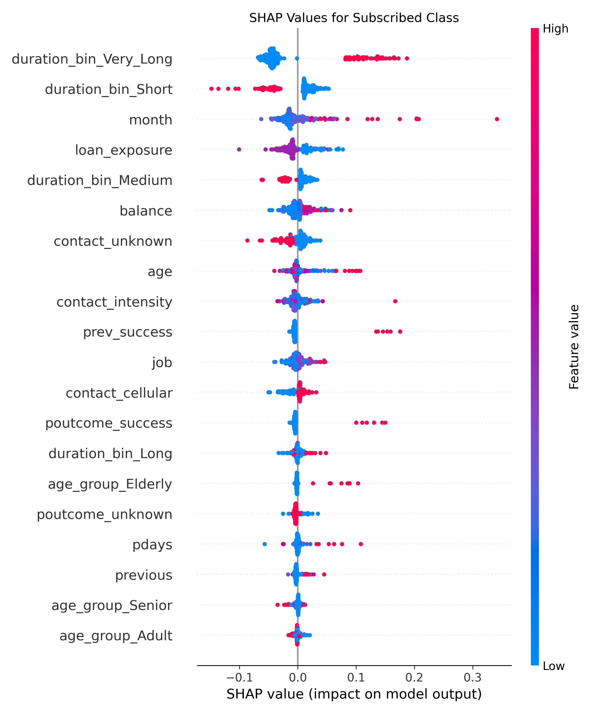
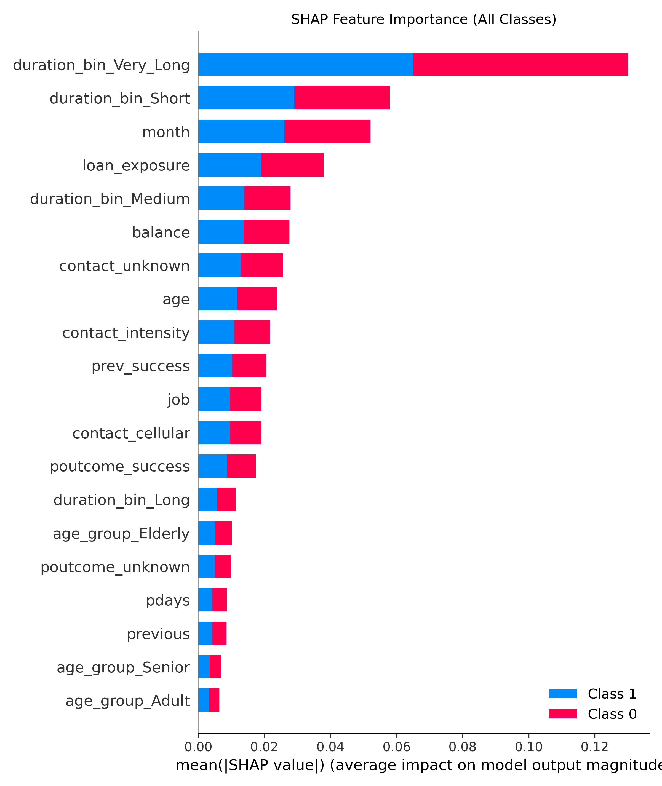
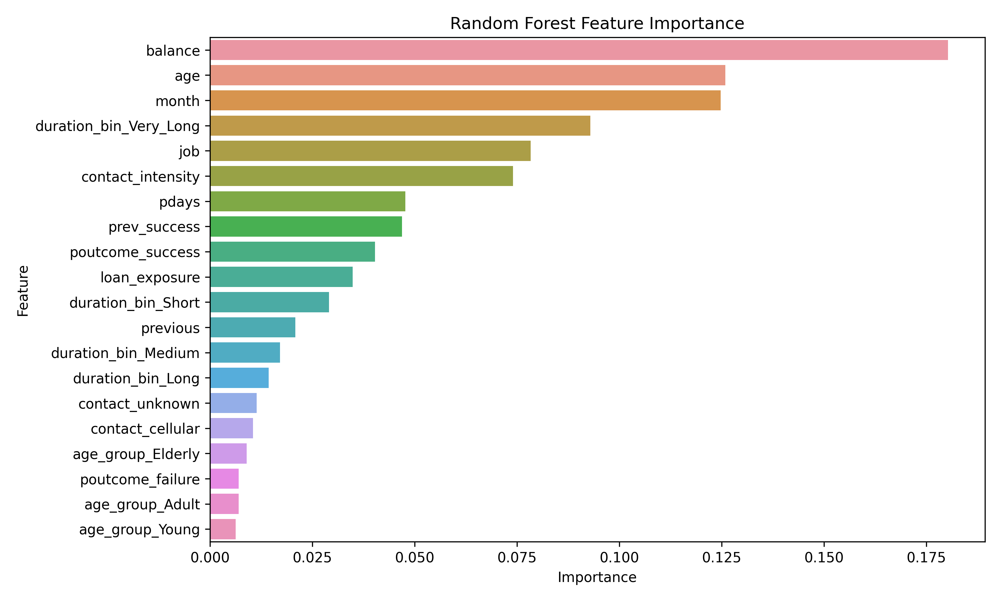

# Bank-Cast 📊

This project builds a **complete machine learning pipeline** to predict whether a customer will subscribe to a term deposit based on their interaction history in a marketing campaign.

---

## 🚀 Features

- **Full ML Pipeline**:
  - Custom imputers and encoders (`SimpleImputer`, `LeaveOneOut`, `OneHot`)
  - Feature engineering with custom ratios and binning
  - Mutual Information-based feature selection
  - Automated scaling & encoding
- **Model Ensemble**:
  - Random Forest, Gradient Boosting, XGBoost, SVM
  - Stacked with Logistic Regression as meta-learner
- **FastAPI Backend**:
  - `/predict` endpoint for live inference
  - `/health` endpoint for service status
- **Serialized Stack**:
  - Trained model + label encoder saved via Pickle
- **Model Explainability**:
  - **SHAP values** for local/global insights
  - Feature importance visualizations
- **Deployment Ready**:
  - Trained ensemble + encoders serialized with Pickle
  - Modular codebase for easy experimentation

---

# 📁 Project Structure

Use this format inside the markdown file (README.md), not inside a comment block.
But if you insist on keeping it here, use indentation:

    Bank-Cast/
    ├── ml_pipeline.py                   # Full data preprocessing pipeline
    ├── train_and_save_model.py          # Training logic and model serialization
    ├── app.py                           # FastAPI app with /predict route
    ├── stacking_model.pkl               # Trained ensemble model (after training)
    ├── label_encoder.pkl                # Label encoder for target class decoding
    ├── feature_importance.png           # Bar chart of feature importances
    ├── shap_summary_all_classes.png     # SHAP summary plot (all classes)
    ├── shap_summary_class1.png          # SHAP subscribed class plot
    └── bank_marketing.csv               # Raw marketing dataset

---

## 🧪 Getting Started

### 1. Clone the repo

    git clone https://github.com/yourusername/Bank-Cast.git
    cd Bank-Cast

### 2. Install requirements

    pip install -r requirements.txt

### 3. Train the model

Ensure `marketing_dataset.csv` is available at the path hardcoded in `train_and_save_model.py`:

    os.path.join(os.path.dirname(__file__), 'marketing_dataset.csv')

Adjust the path if needed. Then run:

    python train_and_save_model.py

This will generate `stacking_model.pkl` and `label_encoder.pkl`.

### 4. Run the API

    uvicorn app:app --reload

---

## 🎯 Usage

### POST /predict

Send JSON like:

    {
      "age": 45,
      "job": "blue-collar",
      "marital": "married",
      "education": "secondary",
      "default": "no",
      "balance": 1200,
      "housing": "yes",
      "loan": "no",
      "contact": "cellular",
      "day": 5,
      "month": "may",
      "duration": 230,
      "campaign": 2,
      "pdays": -1,
      "previous": 0,
      "poutcome": "unknown"
    }

Response:

    {
      "prediction": "no"
    }

### GET /health

    { "status": "ok" }

---

# 📈 Model Performance

## Model Comparison Table

| Model           | Best F1-Weighted CV Score |
|----------------|----------------------------|
| Random Forest  | 0.879                      |
| Gradient Boost | 0.888                      |
| XGBoost        | 0.884                      |
| SVM            | 0.865                      |
| **Stacked Model** | **0.889 ± 0.001**           |

## Stacked Model Classification Report

| Class | Precision | Recall | F1-score | Support |
|-------|-----------|--------|----------|---------|
| no    | 0.92      | 0.98   | 0.95     | 7985    |
| yes   | 0.67      | 0.37   | 0.47     | 1058    |
| **Accuracy** |        |        | **0.90**  | **9043**   |
| **Macro Avg** | 0.80 | 0.67   | 0.71     | 9043    |
| **Weighted Avg** | 0.89 | 0.90   | 0.89     | 9043    |

# 🧠 SHAP Analysis

## Plot 1: SHAP Summary for Class 1 (Subscribed)

Beeswarm plot showing feature influence on class "yes" prediction.

🔥 **Top Influencers:**
- `duration_bin_Very_Long`: Massive positive impact on predicting a subscription.
- `duration_bin_Short`: Strongly reduces likelihood — short calls = low interest.
- `month`: Clear seasonal effect; some months push harder than others.
- `loan_exposure`: Loans seem to be a drag on subscribing.
- `balance`: Higher balances add gentle upward pressure.

🧊 **Lower Impact Features:**
- `age`, `job`, `contact`, `poutcome`: Present, but minimal influence — scattered, closer to zero impact line.

## Plot 2: SHAP Feature Importance (Global View)

🚀 **Dominant Features:**
- `duration_bin_Very_Long`: Centerpiece of the model.
- `duration_bin_Short`, `month`: Still carry solid weight.
- `loan_exposure`, `balance`: Strong supporters.

🪁 **Low Signal Features:**
- All `age_group_*`: Look important, but do nothing.
- `previous`, `pdays`, `poutcome_unknown`: Background noise more than signal.

# 📉 Random Forest Feature Importance vs. SHAP

| Feature              | SHAP Impact   | RF Importance   | Interpretation                         |
|----------------------|---------------|------------------|-----------------------------------------|
| duration_bin_Very_Long | Top feature   | Mid-high rank    | SHAP detects local power                |
| duration_bin_Short     | High (negative) | Mid-tier        | RF misses the directionality            |
| balance                | Mid in SHAP   | #1 in RF         | Likely correlated, overvalued by RF     |
| month                  | High in both  | High in both     | Reliable feature — seasonality rules    |
| age                    | Low in SHAP   | #2 in RF         | Classic RF bait — correlation trap      |
| contact_intensity      | Moderate      | Moderate         | General agreement                       |
| job                    | Mid-low SHAP  | Mid RF           | Meh, not a dealbreaker                  |
| loan_exposure          | Mid SHAP      | Mid RF           | Steady utility across the board         |
| pdays, previous        | Low SHAP      | Inflated RF      | Likely overfitting in RF                |
| age_group_*            | Bottom        | Useless          | Dead weight — safe to remove            |

# 🪓 So What?

- SHAP captures real signal, direction, and local patterns. RF just counts split frequency.
- Favor SHAP-based pruning.
- Retain: `duration_bin_*`, `month`, `loan_exposure`
- Consider removing: `age`, `pdays`, `age_group_*`
- Use permutation importance as a tie-breaker between correlated signals.

# 📌 Notes

- Feature selection is driven by **mutual information + SHAP insights**.
- SHAP > Gini when it comes to interpreting what the model is *actually* doing.
- API input must **match schema exactly** — missing or unexpected keys = failure.

# 🔮 Future Enhancements

- ✅ Add input schema validation with **Pydantic**
- 📘 Extend Swagger / OpenAPI docs
- 📊 Add experiment tracking & versioning
- 🐳 Dockerize and build CI/CD for production

# 🛡️ License

MIT License — use, modify, deploy with intelligence and responsibility.
